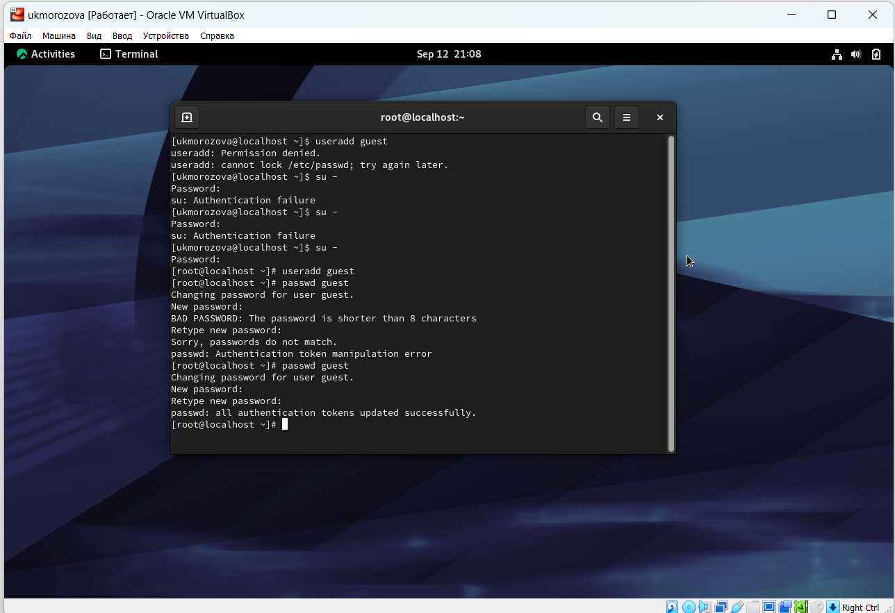
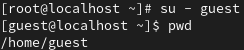
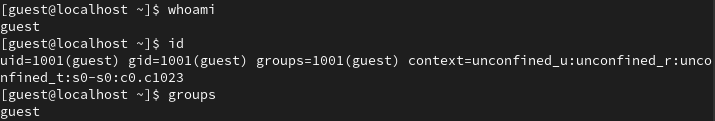
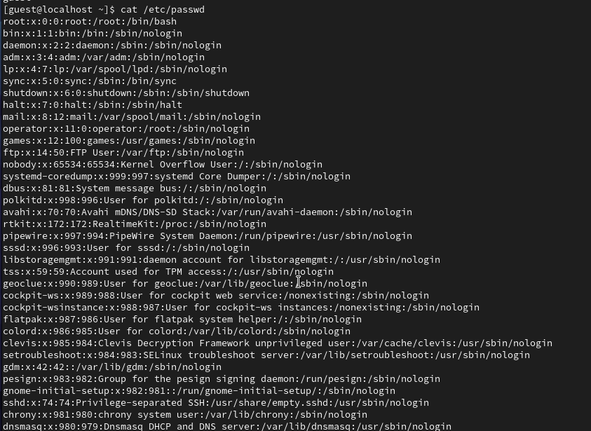
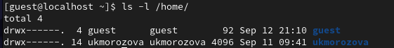
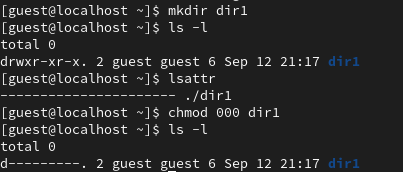
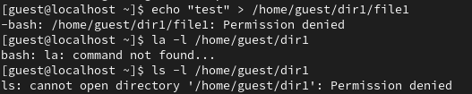
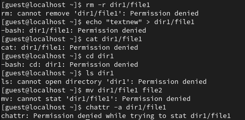
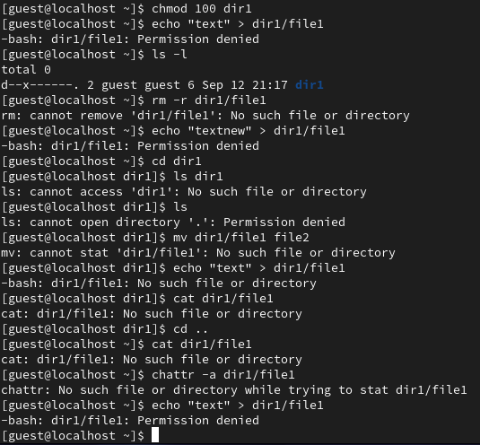

---
## Front matter
title: "Отчет по лабораторной работе №2"
subtitle: "*дисциплина: Основы информационной безопасности*"
author: "Морозова Ульяна Константиновна"

## Generic otions
lang: ru-RU
toc-title: "Содержание"

## Bibliography
bibliography: bib/cite.bib
csl: pandoc/csl/gost-r-7-0-5-2008-numeric.csl

## Pdf output format
toc: true # Table of contents
toc-depth: 2
lof: true # List of figures
lot: true # List of tables
fontsize: 12pt
linestretch: 1.5
papersize: a4
documentclass: scrreprt
## I18n polyglossia
polyglossia-lang:
  name: russian
  options:
	- spelling=modern
	- babelshorthands=true
polyglossia-otherlangs:
  name: english
## I18n babel
babel-lang: russian
babel-otherlangs: english
## Fonts
mainfont: IBM Plex Serif
romanfont: IBM Plex Serif
sansfont: IBM Plex Sans
monofont: IBM Plex Mono
mathfont: STIX Two Math
mainfontoptions: Ligatures=Common,Ligatures=TeX,Scale=0.94
romanfontoptions: Ligatures=Common,Ligatures=TeX,Scale=0.94
sansfontoptions: Ligatures=Common,Ligatures=TeX,Scale=MatchLowercase,Scale=0.94
monofontoptions: Scale=MatchLowercase,Scale=0.94,FakeStretch=0.9
mathfontoptions:
## Biblatex
biblatex: true
biblio-style: "gost-numeric"
biblatexoptions:
  - parentracker=true
  - backend=biber
  - hyperref=auto
  - language=auto
  - autolang=other*
  - citestyle=gost-numeric
## Pandoc-crossref LaTeX customization
figureTitle: "Рис."
tableTitle: "Таблица"
listingTitle: "Листинг"
lofTitle: "Список иллюстраций"
lotTitle: "Список таблиц"
lolTitle: "Листинги"
## Misc options
indent: true
header-includes:
  - \usepackage{indentfirst}
  - \usepackage{float} # keep figures where there are in the text
  - \floatplacement{figure}{H} # keep figures where there are in the text
---

# **Цель работы**

Целью данной работы является получение практических навыков работы в консоли с атрибутами файлов, закрепление теоретических основ дискреционного разграничения доступа в современных системах с открытым кодом на базе ОС Linux.

# Выполнение лабораторной работы

1. В установленной при выполнении лабораторной работы №1 операционной системе создаем учётную запись пользователя guest (используем учётную запись администратора root): useradd guest
Задаем пароль для пользователя guest: passwd guest

2. Входим в систему от имени пользователя guest и определяем директорию, в которой находимся, командой pwd. 

3. Уточним имя пользователя командой whoami, а также уточним имя пользователя, его группу, а также группы, куда входит пользователь, командой id. 

4. Просмотрим файл /etc/passwd командой cat /etc/passwd и найдем в нём свою учётную запись. 

5. Определим существующие в системе директории командой ls -l /home/

6. Проверьте, какие расширенные атрибуты установлены на поддиректориях, находящихся в директории /home, командой:
lsattr /home

7. Создаем в домашней директории поддиректорию dir1 командой mkdir dir1.
Определим командами ls -l и lsattr, какие права доступа и расширенные атрибуты были выставлены на директорию dir1.
Снимаем с директории dir1 все атрибуты командой chmod 000 dir1 и проверяем с её помощью правильность выполнения команды ls -l

8. Попытаемся создать в директории dir1 файл file1 командой echo "test" > /home/guest/dir1/file1. Так как на папке не стоят права для создания файла, у на сне получилось это сделать.
 

9. Заполним таблицу «Установленные права и разрешённые действия», выполняя действия от имени владельца директории.

# Выводы

Мы приобрели практические навыки в работе консоли с атрибутами файлов, закрепили теоретических основ дискреционного разграничения доступа в современных системах с открытым кодом на базе ОС Linux.

::: {#refs}
:::
