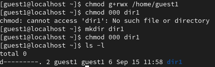

---
## Front matter
lang: ru-RU
title: Лабораторная работа №3
author:
  - Морозова Ульяна
institute:
  - Российский университет дружбы народов, Москва, Россия

## i18n babel
babel-lang: russian
babel-otherlangs: english

## Formatting pdf
toc: false
toc-title: Содержание
slide_level: 2
aspectratio: 169
section-titles: true
theme: metropolis
header-includes:
 - \metroset{progressbar=frametitle,sectionpage=progressbar,numbering=fraction}
---

# Цели

## Цели и задачи

Целью данной работы является получение практических навыков работы в консоли с атрибутами файлов для групп пользователей.

# Создание двух пользователей

# Права доступа для групп пользователей

# Таблица

::: {#refs}
:::