---
## Front matter
title: "Отчет по лабораторной работе №3"
subtitle: "*дисциплина: Информационная безопасность*"
author: "Морозова Ульяна"

## Generic otions
lang: ru-RU
toc-title: "Содержание"

## Bibliography
bibliography: bib/cite.bib
csl: pandoc/csl/gost-r-7-0-5-2008-numeric.csl

## Pdf output format
toc: false # Table of contents
toc-depth: 2
lof: false # List of figures
lot: false # List of tables
fontsize: 12pt
linestretch: 1.5
papersize: a4
documentclass: scrreprt
## I18n polyglossia
polyglossia-lang:
  name: russian
  options:
	- spelling=modern
	- babelshorthands=true
polyglossia-otherlangs:
  name: english
## I18n babel
babel-lang: russian
babel-otherlangs: english
## Fonts
mainfont: IBM Plex Serif
romanfont: IBM Plex Serif
sansfont: IBM Plex Sans
monofont: IBM Plex Mono
mathfont: STIX Two Math
mainfontoptions: Ligatures=Common,Ligatures=TeX,Scale=0.94
romanfontoptions: Ligatures=Common,Ligatures=TeX,Scale=0.94
sansfontoptions: Ligatures=Common,Ligatures=TeX,Scale=MatchLowercase,Scale=0.94
monofontoptions: Scale=MatchLowercase,Scale=0.94,FakeStretch=0.9
mathfontoptions:
## Biblatex
biblatex: true
biblio-style: "gost-numeric"
biblatexoptions:
  - parentracker=true
  - backend=biber
  - hyperref=auto
  - language=auto
  - autolang=other*
  - citestyle=gost-numeric
## Pandoc-crossref LaTeX customization
figureTitle: "Рис."
tableTitle: "Таблица"
listingTitle: "Листинг"
lofTitle: "Список иллюстраций"
lotTitle: "Список таблиц"
lolTitle: "Листинги"
## Misc options
indent: true
header-includes:
  - \usepackage{indentfirst}
  - \usepackage{float} # keep figures where there are in the text
  - \floatplacement{figure}{H} # keep figures where there are in the text
---

# Цель работы

Получение практических навыков работы в консоли с атрибутами файлов для групп пользователей.

# Выполнение лабораторной работы

1. В установленной операционной системе создаем учётную запись пользователя guest1 (использую учётную запись администратора) и задаем пароль для пользователя guest1 (использую учётную запись администратора). Аналогично создаем второго пользователя guest2.

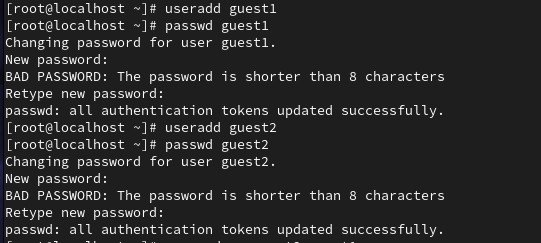{#fig:001 width=70%}

2. Добавляем пользователя guest2 в группу guest:

{#fig:002 width=70%}

3. Осуществим вход в систему от двух пользователей на двух разных консолях: guest на первой консоли и guest2 на второй консоли, и определим директорию для обоих пользователей.

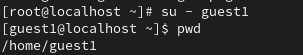{#fig:003 width=70%}

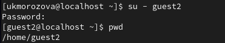{#fig:004 width=70%}

4. Уточним имя наших пользователей, их группу. 

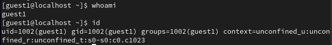{#fig:005 width=70%}

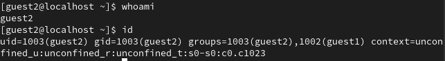{#fig:006 width=70%}

{#fig:007 width=70%}

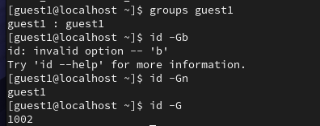{#fig:008 width=70%}

5. Просмотрим файл командой
cat /etc/group

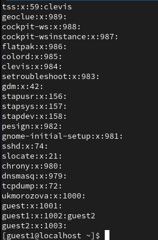{#fig:009 width=70%}

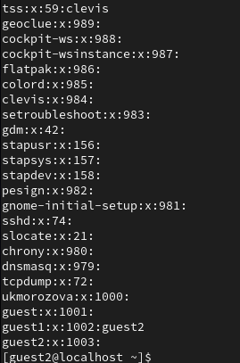{#fig:010 width=70%}

6. От имени пользователя guest2 выполним регистрацию пользователя guest2 в группе guest командой newgrp guest.

{#fig:011 width=70%}

7. От имени пользователя guest изменим права директории /home/guest, разрешив все действия для пользователей группы:
chmod g+rwx /home/guest и снимим с директории /home/guest/dir1 все атрибуты командой chmod 000 dirl

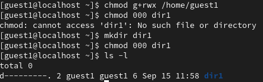{#fig:012 width=70%}

8. Таблица прав доступа 

{#fig:013 width=70%}

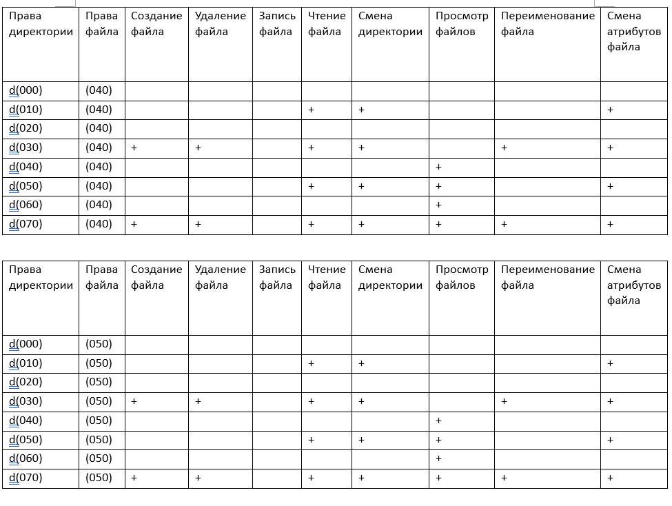{#fig:014 width=70%}

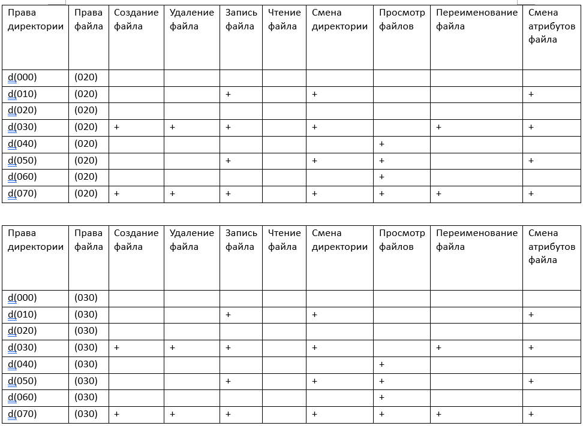{#fig:015 width=70%}

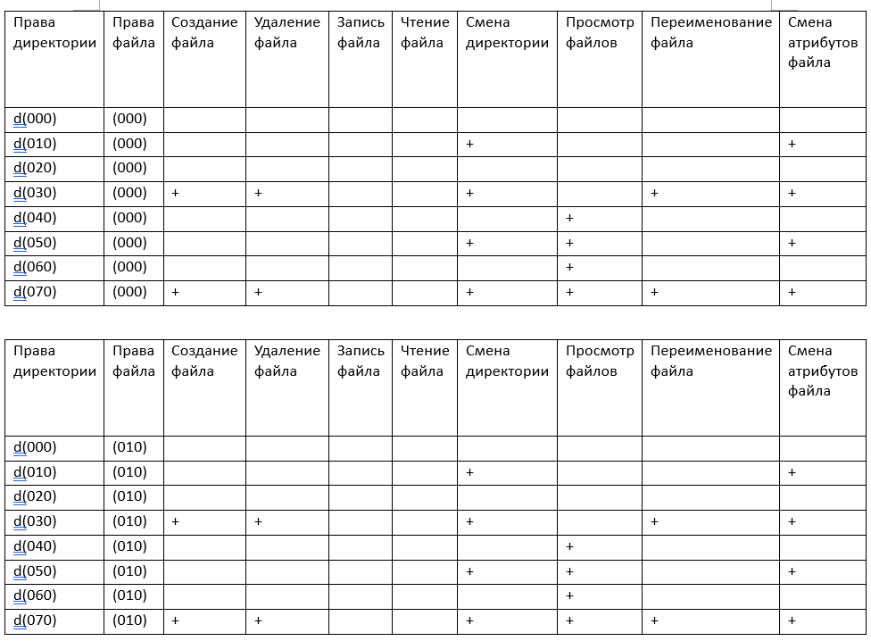{#fig:016 width=70%}

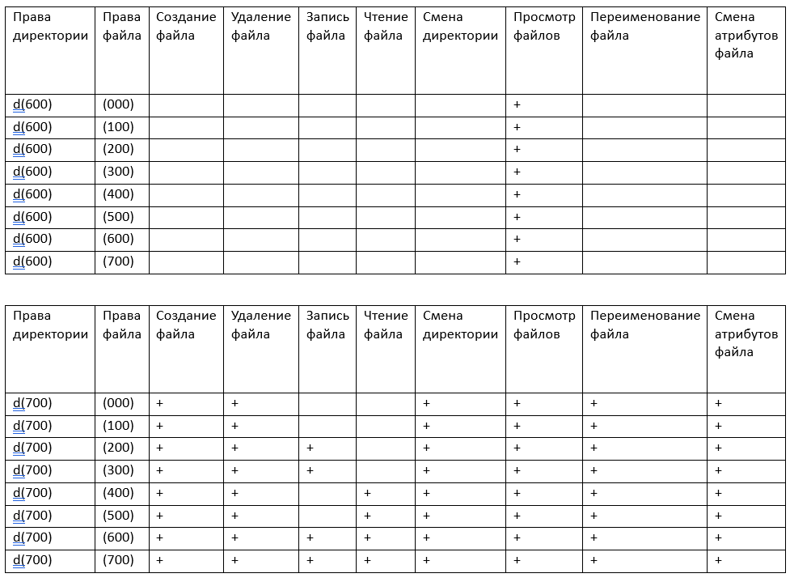{#fig:017 width=70%}

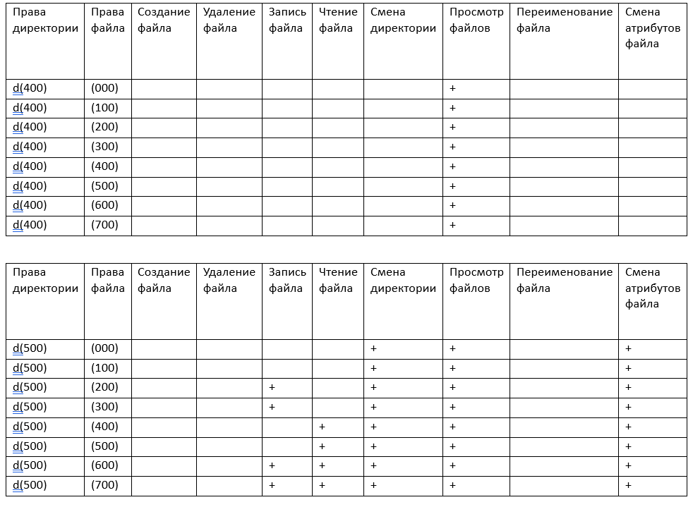{#fig:018 width=70%}

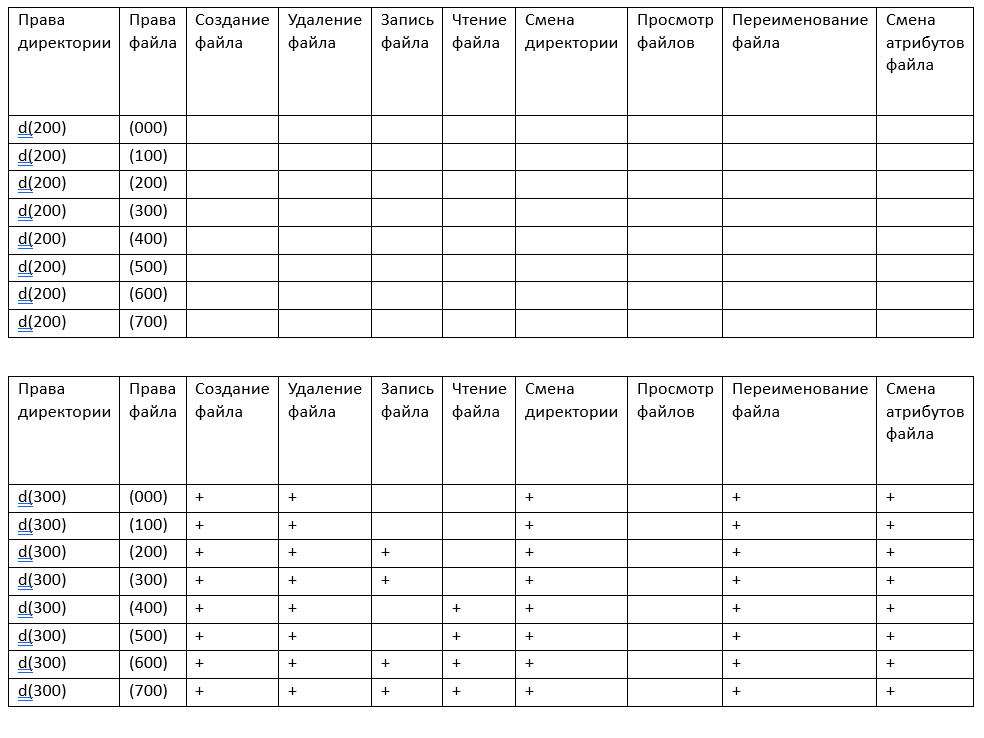{#fig:019 width=70%}

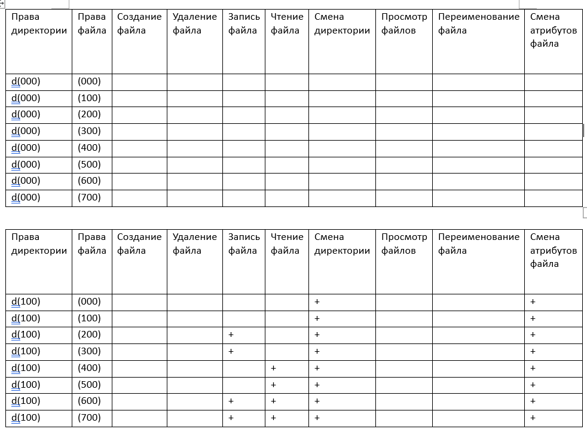{#fig:020 width=70%}

# Выводы

Мы получили практические навыки работы в консоли с атрибутами файлов для групп пользователей.

# Список литературы{.unnumbered}

::: {#refs}
:::
