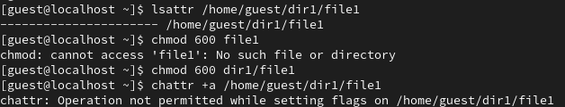
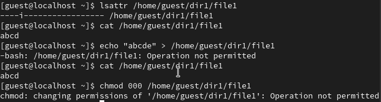

---
## Front matter
lang: ru-RU
title: Лабораторная работа №4
author:
  - Морозова У.К.
institute:
  - Российский университет дружбы народов, Москва, Россия

## i18n babel
babel-lang: russian
babel-otherlangs: english

## Formatting pdf
toc: false
toc-title: Содержание
slide_level: 2
aspectratio: 169
section-titles: true
theme: metropolis
header-includes:
 - \metroset{progressbar=frametitle,sectionpage=progressbar,numbering=fraction}
---

# Цели и задачи

- Получение практических навыков работы в консоли с расширенными атрибутами файлов.

# Изменение атрибутов

{#fig:001 width=70%}

# Использование другого атрибута

{#fig:001 width=70%}

:::

