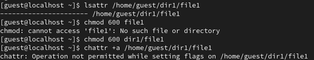
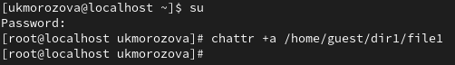
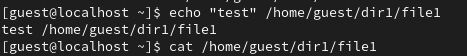
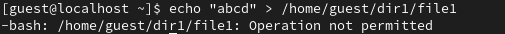
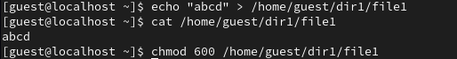
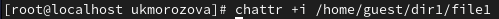
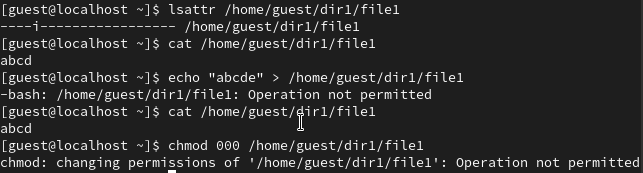

---
## Front matter
title: "Отчёт по лабораторной работе №4"
subtitle: "*дисциплина: Информационная безопасность*"
author: "Морозова Ульяна Константиновна"

## Generic otions
lang: ru-RU
toc-title: "Содержание"

## Bibliography
bibliography: bib/cite.bib
csl: pandoc/csl/gost-r-7-0-5-2008-numeric.csl

## Pdf output format
toc: true # Table of contents
toc-depth: 2
lof: true # List of figures
lot: false # List of tables
fontsize: 12pt
linestretch: 1.5
papersize: a4
documentclass: scrreprt
## I18n polyglossia
polyglossia-lang:
  name: russian
  options:
	- spelling=modern
	- babelshorthands=true
polyglossia-otherlangs:
  name: english
## I18n babel
babel-lang: russian
babel-otherlangs: english
## Fonts
mainfont: IBM Plex Serif
romanfont: IBM Plex Serif
sansfont: IBM Plex Sans
monofont: IBM Plex Mono
mathfont: STIX Two Math
mainfontoptions: Ligatures=Common,Ligatures=TeX,Scale=0.94
romanfontoptions: Ligatures=Common,Ligatures=TeX,Scale=0.94
sansfontoptions: Ligatures=Common,Ligatures=TeX,Scale=MatchLowercase,Scale=0.94
monofontoptions: Scale=MatchLowercase,Scale=0.94,FakeStretch=0.9
mathfontoptions:
## Biblatex
biblatex: true
biblio-style: "gost-numeric"
biblatexoptions:
  - parentracker=true
  - backend=biber
  - hyperref=auto
  - language=auto
  - autolang=other*
  - citestyle=gost-numeric
## Pandoc-crossref LaTeX customization
figureTitle: "Рис."
tableTitle: "Таблица"
listingTitle: "Листинг"
lofTitle: "Список иллюстраций"
lotTitle: "Список таблиц"
lolTitle: "Листинги"
## Misc options
indent: true
header-includes:
  - \usepackage{indentfirst}
  - \usepackage{float} # keep figures where there are in the text
  - \floatplacement{figure}{H} # keep figures where there are in the text
---

# Цель работы

Получение практических навыков работы в консоли с расширенными атрибутами файлов.

# Выполнение лабораторной работы

1. От имени пользователя guest определим расширенные атрибуты файла /home/guest/dir1/file1 командой (рис. [-@fig:001])
```bash
lsattr /home/guest/dir1/file1
```
Установим командой
```bash
chmod 600 file1
```
на файл file1 права, разрешающие чтение и запись для владельца файла.
Попробуем установить на файл /home/guest/dir1/file1 расширенный атрибут a от имени пользователя guest:
```bash
chattr +a /home/guest/dir1/file1
```
В ответ мы ожидаемо получили отказ от выполнения операции (рис. [-@fig:001]).

{#fig:001 width=70%}

2. Зайдем на третью консоль и повысим свои права с помощью команды su. И теперь попробуем установить расширенный атрибут a на файл /home/guest/dir1/file1 от имени пользователя с правами администратора (суперпользователя) (рис. [-@fig:002]):
```bash
chattr +a /home/guest/dir1/file1
```

{#fig:002 width=70%}

3. От пользователя guest убедимся (рис. [-@fig:003]), что атрибут установился правильно 
```bash
lsattr /home/guest/dir1/file1
```
и выполним дозапись в файл file1 слова «test» командой
```bash
echo "test" /home/guest/dir1/file1
```
После этого выполним чтение файла file1 командой
```bash
cat /home/guest/dir1/file1
```

{#fig:003 width=70%}

4. Попробуем стереть имеющуюся в файле информацию командой
```bash
echo "abcd" > /home/guest/dirl/file1
```
в ответ получаем запрет на выполнение команды (рис. [-@fig:004]).

{#fig:004 width=70%}

Также с помощью команды
```bash
chmod 000 file1
```
не удалось установить на файл file1 права, запрещающие чтение и запись для владельца файла.

5. Снимем расширенный атрибут a с файла /home/guest/dirl/file1 от имени суперпользователя командой (рис. [-@fig:005])
```bash
chattr -a /home/guest/dir1/file1
```

{#fig:005 width=70%}

и повторим операции, которые нам ранее не удавалось выполнить (рис. [-@fig:006]).

{#fig:006 width=70%}

6. Заменив атрибут «a» атрибутом «i» (рис. [-@fig:007]), повторим все действия описанные выше (рис. [-@fig:008]).

{#fig:007 width=70%}

{#fig:008 width=70%}

# Выводы

В результате выполнения работы вы повысили свои навыки использования интерфейса командой строки (CLI), познакомились на примерах с тем, как используются основные и расширенные атрибуты при разграничении доступа.

# Список литературы{.unnumbered}

::: {#refs}
:::
