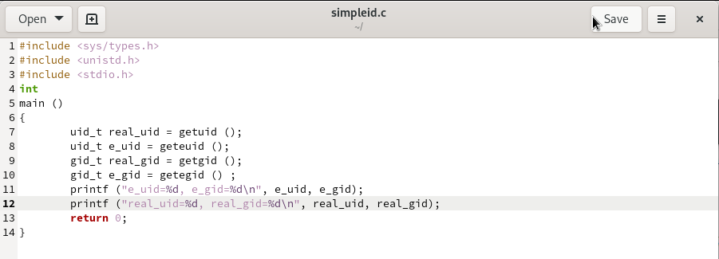
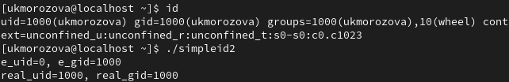
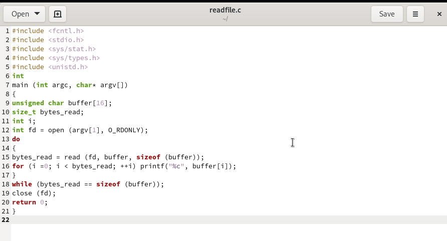
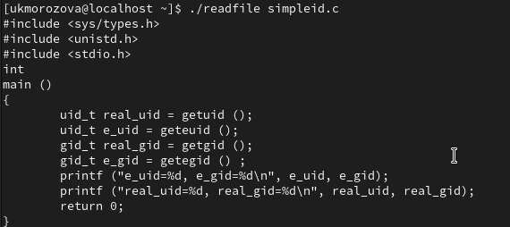
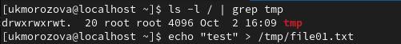
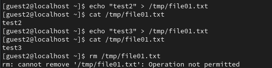

---
## Front matter
lang: ru-RU
title: Лабораторная работа №5
author:
  - Морозова У.К.
institute:
  - Российский университет дружбы народов, Москва, Россия

## i18n babel
babel-lang: russian
babel-otherlangs: english

## Formatting pdf
toc: false
toc-title: Содержание
slide_level: 2
aspectratio: 169
section-titles: true
theme: metropolis
header-includes:
 - \metroset{progressbar=frametitle,sectionpage=progressbar,numbering=fraction}
---

# Цели и задачи

- Изучение механизмов изменения идентификаторов, применения SetUID- и Sticky-битов. Получение практических навыков работы в консоли с дополнительными атрибутами. Рассмотрение работы механизма смены идентификатора процессов пользователей, а также влияние бита
Sticky на запись и удаление файлов

# Создание программ

## Программа 1

{#fig:001 width=70%}

{#fig:002 width=70%}

## Программа 2

{#fig:003 width=70%}

## readfile

{#fig:004 width=70%}

# Изменение атрибутов

{#fig:005 width=70%}

{#fig:006 width=70%}
