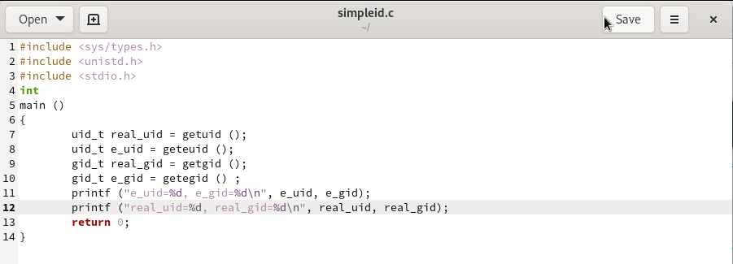
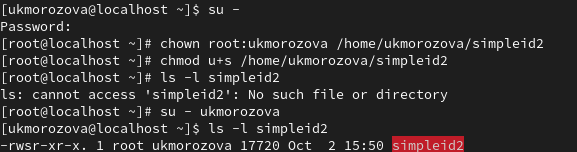

---
## Front matter
title: "Отчёт по лабораторной работе №5"
subtitle: "*дисциплина: Информационная безопасность*"
author: "Морозова Ульяна"

## Generic otions
lang: ru-RU
toc-title: "Содержание"

## Bibliography
bibliography: bib/cite.bib
csl: pandoc/csl/gost-r-7-0-5-2008-numeric.csl

## Pdf output format
toc: true # Table of contents
toc-depth: 2
lof: true # List of figures
lot: false # List of tables
fontsize: 12pt
linestretch: 1.5
papersize: a4
documentclass: scrreprt
## I18n polyglossia
polyglossia-lang:
  name: russian
  options:
	- spelling=modern
	- babelshorthands=true
polyglossia-otherlangs:
  name: english
## I18n babel
babel-lang: russian
babel-otherlangs: english
## Fonts
mainfont: IBM Plex Serif
romanfont: IBM Plex Serif
sansfont: IBM Plex Sans
monofont: IBM Plex Mono
mathfont: STIX Two Math
mainfontoptions: Ligatures=Common,Ligatures=TeX,Scale=0.94
romanfontoptions: Ligatures=Common,Ligatures=TeX,Scale=0.94
sansfontoptions: Ligatures=Common,Ligatures=TeX,Scale=MatchLowercase,Scale=0.94
monofontoptions: Scale=MatchLowercase,Scale=0.94,FakeStretch=0.9
mathfontoptions:
## Biblatex
biblatex: true
biblio-style: "gost-numeric"
biblatexoptions:
  - parentracker=true
  - backend=biber
  - hyperref=auto
  - language=auto
  - autolang=other*
  - citestyle=gost-numeric
## Pandoc-crossref LaTeX customization
figureTitle: "Рис."
tableTitle: "Таблица"
listingTitle: "Листинг"
lofTitle: "Список иллюстраций"
lotTitle: "Список таблиц"
lolTitle: "Листинги"
## Misc options
indent: true
header-includes:
  - \usepackage{indentfirst}
  - \usepackage{float} # keep figures where there are in the text
  - \floatplacement{figure}{H} # keep figures where there are in the text
---

# Цель работы

Изучение механизмов изменения идентификаторов, применения SetUID- и Sticky-битов. Получение практических навыков работы в консоли с дополнительными атрибутами. Рассмотрение работы механизма смены идентификатора процессов пользователей, а также влияние бита
Sticky на запись и удаление файлов.

# Подготовка к лабораторной работе

Перед тем как начнем выполнять задания убедимся, что у нас установлен компилятор gcc (рис. [-@fig:001]).

{#fig:001 width=70%}

# Выполнение лабораторной работы

## Создание программ

1. Зайдем  систему о имени пользователя ukmorozova и создадим файл simpleid.c (рис. [-@fig:002]).

{#fig:002 width=70%}

2. Скомпилируем программу и убедимся, что исполнительный файл был создан, затем выполним пррограмму simpleid и сравним ее с выполнением команды id (рис. [-@fig:003] - рис. [-@fig:004])

{#fig:003 width=70%}

{#fig:004 width=70%}

Как видно, команды выводят одинаковую информацию.

3. Усложним программу (рис. [-@fig:005]) скомпилируем и запустим ее (рис. [-@fig:006]).

{#fig:005 width=70%}

{#fig:006 width=70%}

4. От имени суперпользователя выполняем следующие команды
```bash
chown root:guest /home/guest/simpleid2
chmod u+s /home/guest/simpleid2
```
и проверяем правильность выполнения команд (рис. [-@fig:007]).

{#fig:007 width=70%}

Запускаем программу simpleid2 и команду id (рис. [-@fig:008]).

{#fig:008 width=70%}

5. Создаем программу readfile.c (рис. [-@fig:009]) и откомпилируем ее (рис. [-@fig:010])

{#fig:009 width=70%}

{#fig:010 width=70%}

Меняем владельца файла, что ukmorozova не мог прочитать его (рис. [-@fig:011]), проверяем (рис. [-@fig:012]).

{#fig:011 width=70%}

{#fig:012 width=70%}

Установим SetU'D-бит (рис. [-@fig:013]).

{#fig:013 width=70%}

6. Пробуем прочитать разные файлы с помощью программы readfile.c (рис. [-@fig:014] - рис. [-@fig:016]))

{#fig:014 width=70%}

{#fig:015 width=70%}

{#fig:016 width=70%}

## Исследование Sticky-бита

1. Выясним, установлен ли атрибут Sticky на директории /tmp и создадим файл file01.txt в директории /tmp со словом test (рис. [-@fig:017]).

{#fig:017 width=70%}

3. Просмотрим атрибуты у только что созданного файла и разрешим чтение и запись для категории пользователей «все остальные» (рис. [-@fig:018])

{#fig:018 width=70%}

4. От имени другого пользователя попробуем прочитать файл /tmp/file01.txt (рис. [-@fig:019]).

{#fig:019 width=70%}

5. Попробуем дозаписать в файл /tmp/file01.txt слово test2 командой и проверим содержимое файла, затем попробуем удалить его (рис. [-@fig:020]).

{#fig:020 width=70%}

6. Повысим свои права до суперпользователя и выполним команду, снимающую атрибут t (Sticky-бит) с директории /tmp (рис. [-@fig:021]).

{#fig:021 width=70%}

Проверим выполнение команды от имени guest2 (рис. [-@fig:022]) и повторим шаги выше (рис. [-@fig:023]).

{#fig:022 width=70%}

{#fig:023 width=70%}

После всего возвращаем атрибут t (рис. [-@fig:024]).

{#fig:024 width=70%}

# Выводы

Изучили механизмы изменения идентификаторов, применили SetUID- и Sticky-битов.

# Список литературы{.unnumbered}

::: {#refs}
:::
