---
## Front matter
lang: ru-RU
title: Лабораторная работа №6
author:
  - Морозова У.К.
institute:
  - Российский университет дружбы народов, Москва, Россия

## i18n babel
babel-lang: russian
babel-otherlangs: english

## Formatting pdf
toc: false
toc-title: Содержание
slide_level: 2
aspectratio: 169
section-titles: true
theme: metropolis
header-includes:
 - \metroset{progressbar=frametitle,sectionpage=progressbar,numbering=fraction}
---

# Цель работы

Развить навыки администрирования ОС Linux. Получить первое практическое знакомство с технологией SELinux1.
Проверить работу SELinx на практике совместно с веб-сервером Apache.

# Подготовка к лабораторной работе 

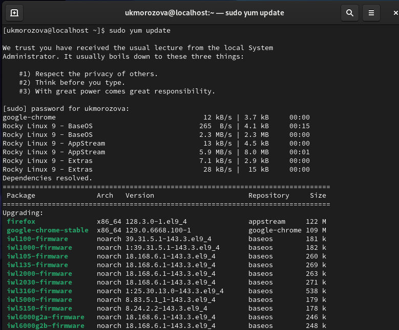{#fig:001 width=70%}

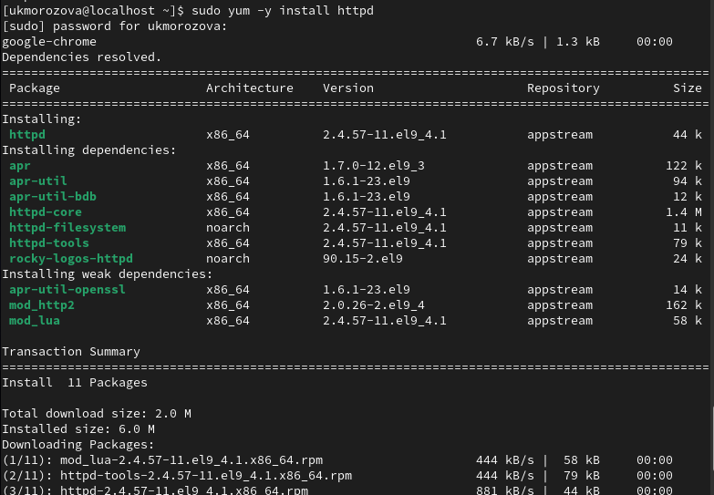{#fig:002 width=70%}

# Выполнение лабораторной работы

## 1

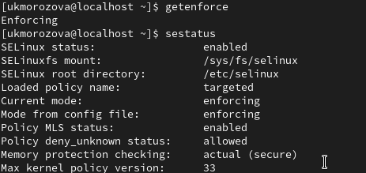{#fig:003 width=70%}

## 2

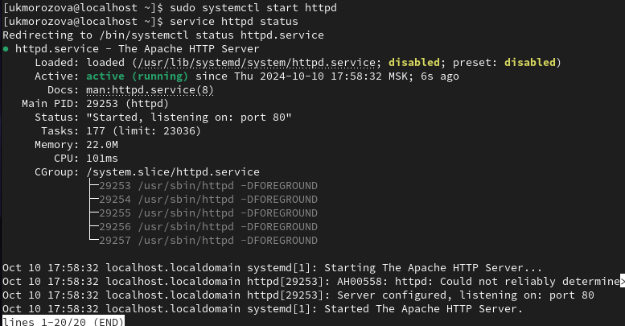{#fig:004 width=70%}

## 3

{#fig:005 width=70%}

## 4

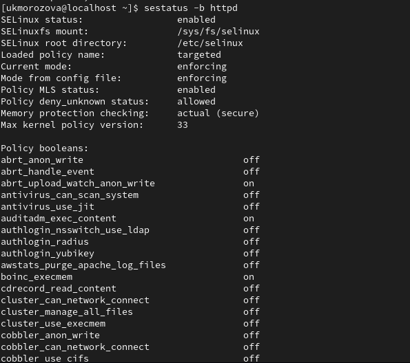{#fig:006 width=70%}

## 5

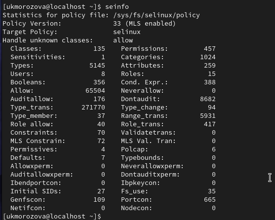{#fig:007 width=70%}

## 6

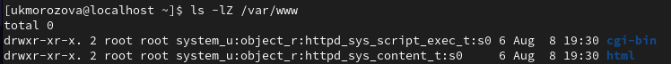{#fig:008 width=70%}

## 7

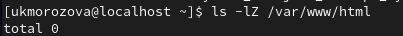{#fig:009 width=70%}

## 8

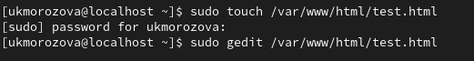{#fig:010 width=70%}

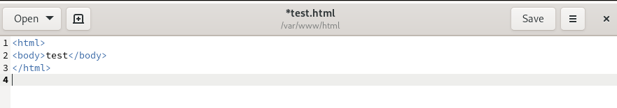{#fig:011 width=70%}

## 9

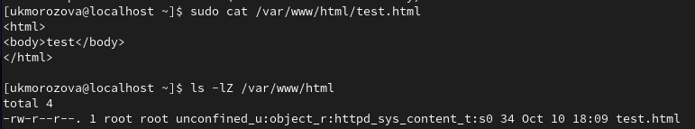{#fig:012 width=70%}

## 10

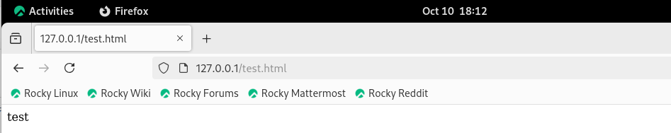{#fig:013 width=70%}

## 11

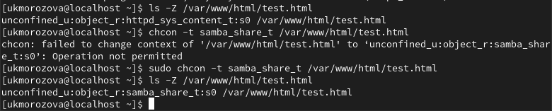{#fig:014 width=70%}

## 12

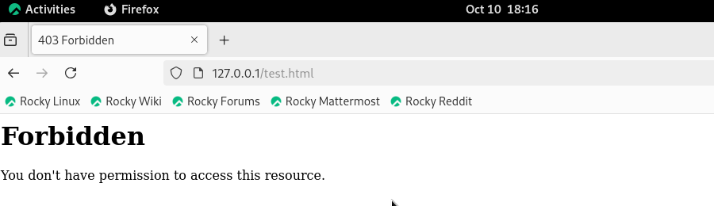{#fig:015 width=70%}

## 13

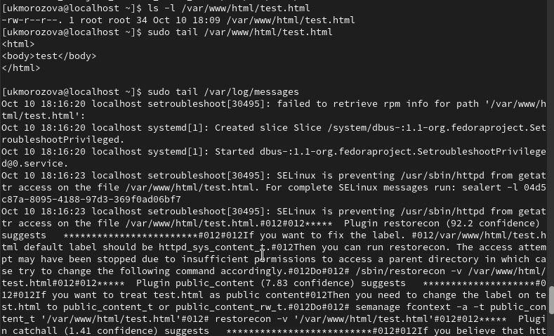{#fig:016 width=70%}

## 14

{#fig:017 width=70%}

## 15

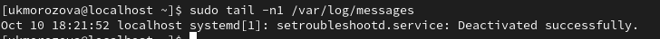{#fig:018 width=70%}

## 16

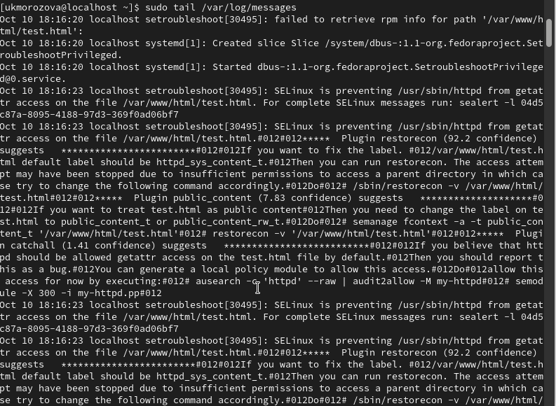{#fig:019 width=70%}

## 17

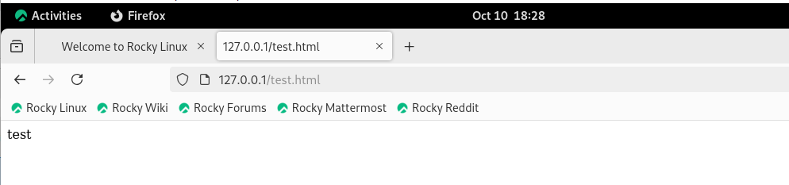{#fig:021 width=70%}

# Выводы

Развили навыки администрирования ОС Linux. Получили первое практическое знакомство с технологией SELinux1.
Проверили работу SELinx на практике совместно с веб-сервером Apache.
