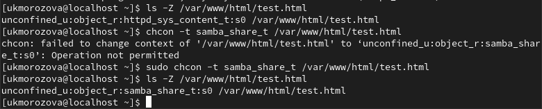

---
## Front matter
title: "Отчёт по лабораторной работе №6"
subtitle: "*дисциплина: Информационная безопасность*"
author: "Морозова Ульяна"

## Generic otions
lang: ru-RU
toc-title: "Содержание"

## Bibliography
bibliography: bib/cite.bib
csl: pandoc/csl/gost-r-7-0-5-2008-numeric.csl

## Pdf output format
toc: true # Table of contents
toc-depth: 2
lof: true # List of figures
lot: false # List of tables
fontsize: 12pt
linestretch: 1.5
papersize: a4
documentclass: scrreprt
## I18n polyglossia
polyglossia-lang:
  name: russian
  options:
	- spelling=modern
	- babelshorthands=true
polyglossia-otherlangs:
  name: english
## I18n babel
babel-lang: russian
babel-otherlangs: english
## Fonts
mainfont: IBM Plex Serif
romanfont: IBM Plex Serif
sansfont: IBM Plex Sans
monofont: IBM Plex Mono
mathfont: STIX Two Math
mainfontoptions: Ligatures=Common,Ligatures=TeX,Scale=0.94
romanfontoptions: Ligatures=Common,Ligatures=TeX,Scale=0.94
sansfontoptions: Ligatures=Common,Ligatures=TeX,Scale=MatchLowercase,Scale=0.94
monofontoptions: Scale=MatchLowercase,Scale=0.94,FakeStretch=0.9
mathfontoptions:
## Biblatex
biblatex: true
biblio-style: "gost-numeric"
biblatexoptions:
  - parentracker=true
  - backend=biber
  - hyperref=auto
  - language=auto
  - autolang=other*
  - citestyle=gost-numeric
## Pandoc-crossref LaTeX customization
figureTitle: "Рис."
tableTitle: "Таблица"
listingTitle: "Листинг"
lofTitle: "Список иллюстраций"
lotTitle: "Список таблиц"
lolTitle: "Листинги"
## Misc options
indent: true
header-includes:
  - \usepackage{indentfirst}
  - \usepackage{float} # keep figures where there are in the text
  - \floatplacement{figure}{H} # keep figures where there are in the text
---

# Цель работы

Развить навыки администрирования ОС Linux. Получить первое практическое знакомство с технологией SELinux1.
Проверить работу SELinx на практике совместно с веб-сервером Apache.

# Подготовка к лабораторной работе 

{#fig:001 width=70%}

{#fig:002 width=70%}

# Выполнение лабораторной работы

1. Войдите в систему с полученными учётными данными и убедитесь, что SELinux работает в режиме enforcing политики targeted с помощью команд getenforce и sestatus (рис. [-@fig:003]).

{#fig:003 width=70%}

2. Обратитесь с помощью браузера к веб-серверу, запущенному на вашем
компьютере, и убедитесь, что последний работает:
```bash
service httpd status
```
Если не работает, запустите его так же, но с параметром start (рис. [-@fig:004]).

{#fig:004 width=70%}

3. Найдите веб-сервер Apache в списке процессов, определите его контекст безопасности и занесите эту информацию в отчёт (рис. [-@fig:005]). Например, можно использовать команду
```bash
ps auxZ | grep httpd
```

{#fig:005 width=70%}

4. Посмотрите текущее состояние переключателей SELinux для Apache спомощью команды
```bash
sestatus -bigrep httpd
```
Обратите внимание, что многие из них находятся в положении «off» (рис. [-@fig:006]).

{#fig:006 width=70%}

5. Посмотрите статистику по политике с помощью команды seinfo, также определите множество пользователей, ролей, типов (рис. [-@fig:007]).

{#fig:007 width=70%}

6. Определите тип файлов и поддиректорий (рис. [-@fig:008]), находящихся в директории /var/www, с помощью команды
```bash
ls -lZ /var/www
```

{#fig:008 width=70%}

7. Определите тип файлов (рис. [-@fig:009]), находящихся в директории /var/www/html:
```bash
ls -lZ /var/www/html
```

{#fig:009 width=70%}

8. Создайте от имени суперпользователя html-файл /var/www/html/test.html следующего содержания (рис. [-@fig:010] - рис. [-@fig:011]):
```html
<html>
<body>test</body>
</html>
``` 

{#fig:010 width=70%}

{#fig:011 width=70%}

9. Проверьте контекст созданного вами файла (рис. [-@fig:012]). Занесите в отчёт контекст, присваиваемый по умолчанию вновь созданным файлам в директории /var/www/html.

{#fig:012 width=70%}

10. Обратитесь к файлу через веб-сервер, введя в браузере адрес http://127.0.0.1/test.html (рис. [-@fig:013]). Убедитесь, что файл был успешно отображён.

{#fig:013 width=70%}

11. Проверьте контекст файла командой
```bash
ls -Z /var/www/html/test.html
```
Измените контекст файла /var/www/html/test.html с httpd_sys_content_t на любой другой (рис. [-@fig:014]), к которому процесс httpd не должен иметь доступа, например, на samba_share_t:
```bash
chcon -t samba_share_t /var/www/html/test.html
ls -Z /var/www/html/test.html
```

{#fig:014 width=70%}

12. Попробуйте ещё раз получить доступ к файлу через веб-сервер, введя в браузере адрес http://127.0.0.1/test.html (рис. [-@fig:015]). Вы должны получить сообщение об ошибке:
Forbidden
You don't have permission to access /test.html on this server.

{#fig:015 width=70%}

13. Проанализируйте ситуацию. Почему файл не был отображён, если права доступа позволяют читать этот файл любому пользователю?
```bash
ls -l /var/www/html/test.html
```
Просмотрите log-файлы веб-сервера Apache (рис. [-@fig:016]). Также просмотрите системный лог-файл:
```bash
tail /var/log/messages
```

{#fig:016 width=70%}

14. Попробуйте запустить веб-сервер Apache на прослушивание ТСР-порта 81 (а не 80, как рекомендует IANA и прописано в /etc/services). Для
этого в файле /etc/httpd/httpd.conf найдите строчку Listen 80 и замените её на Listen 81 (рис. [-@fig:017]).

{#fig:017 width=70%}

15. Проанализируйте лог-файлы (рис. [-@fig:018]):
```bash
tail -nl /var/log/messages
```

{#fig:018 width=70%}

Просмотрите файлы /var/log/http/error_log, /var/log/http/access_log и /var/log/audit/audit.log и выясните, в каких файлах появились записи (рис. [-@fig:019]).

{#fig:019 width=70%}

16. Выполните команду
```bash
semanage port -a -t http_port_t -р tcp 81
```
После этого проверьте список портов командой
```bash
semanage port -l | grep http_port_t
```
Убедитесь, что порт 81 появился в списке (рис. [-@fig:020]).

{#fig:020 width=70%}

17. Верните контекст httpd_sys_cоntent__t к файлу /var/www/html/ test.html:
```bash
chcon -t httpd_sys_content_t /var/www/html/test.html
```
После этого попробуйте получить доступ к файлу через веб-сервер, введя в браузере адрес http://127.0.0.1:81/test.html.
Вы должны увидеть содержимое файла — слово «test» (рис. [-@fig:021]). 

{#fig:021 width=70%}

18. Исправьте обратно конфигурационный файл apache, вернув Listen 80 (рис. [-@fig:022]).

{#fig:022 width=70%}

19. Удалите привязку http_port_t к 81 порту:
```bash
semanage port -d -t http_port_t -p tcp 81
```
и проверьте, что порт 81 удалён (рис. [-@fig:023]).

{#fig:023 width=70%}

24. Удалите файл /var/www/html/test.html (рис. [-@fig:024]):
```bash
rm /var/www/html/test.html
```

{#fig:024 width=70%}

# Выводы

Развили навыки администрирования ОС Linux. Получили первое практическое знакомство с технологией SELinux1.
Проверили работу SELinx на практике совместно с веб-сервером Apache.

# Список литературы{.unnumbered}

::: {#refs}
:::
