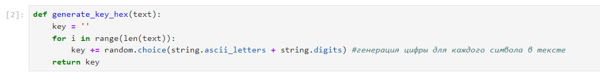
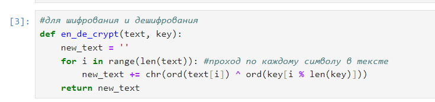
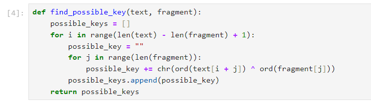
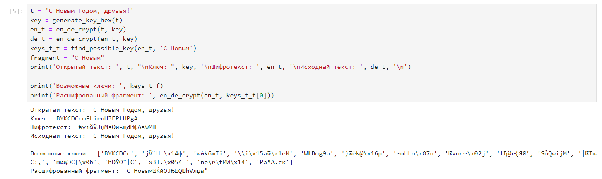

---
## Front matter
lang: ru-RU
title: Лабораторная работа №7
author:
  - Морозова У.К.
institute:
  - Российский университет дружбы народов, Москва, Россия

## i18n babel
babel-lang: russian
babel-otherlangs: english

## Formatting pdf
toc: false
toc-title: Содержание
slide_level: 2
aspectratio: 169
section-titles: true
theme: metropolis
header-includes:
 - \metroset{progressbar=frametitle,sectionpage=progressbar,numbering=fraction}
---

# Цели и задачи

- Освоить на практике применение режима однократного гаммирования

# Выполнение лабораторной работы

## Импорт библиотек

{#fig:001 width=70%}

## Создание функции для генерации ключа

{#fig:002 width=70%}

## Функция для (де)шифрования

{#fig:003 width=70%}

## Функция нахождения всех возможных ключей

{#fig:004 width=70%}

## Проверка работы программы

{#fig:005 width=70%}

# Выводы

Мы освоили на практике применение режима однократного гаммирования
