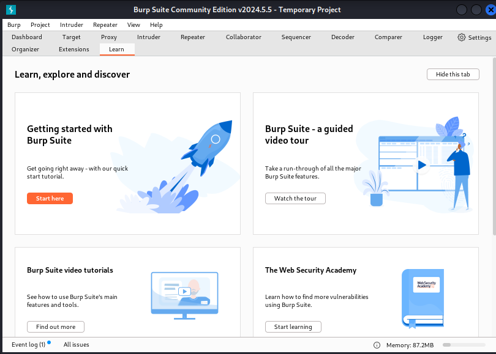
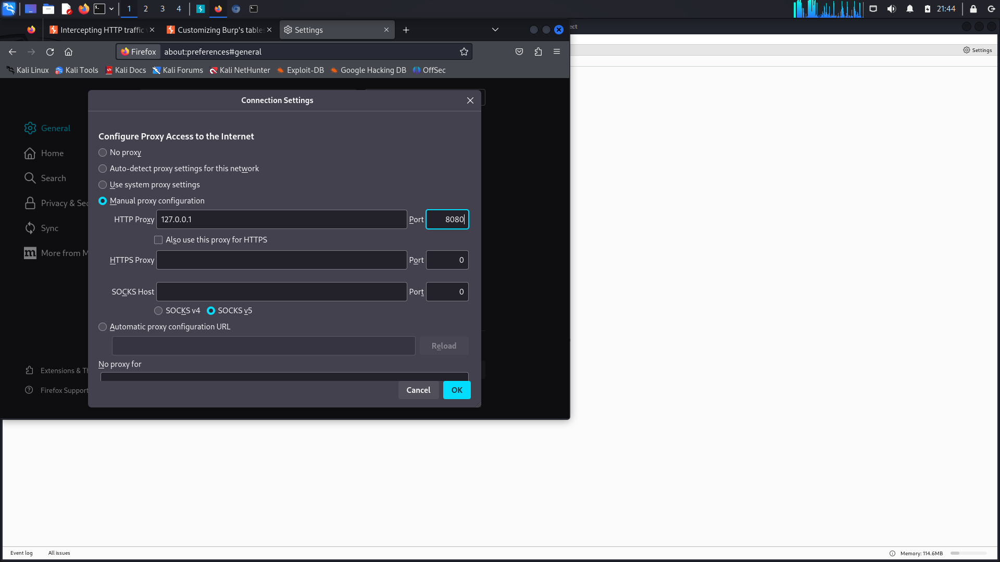
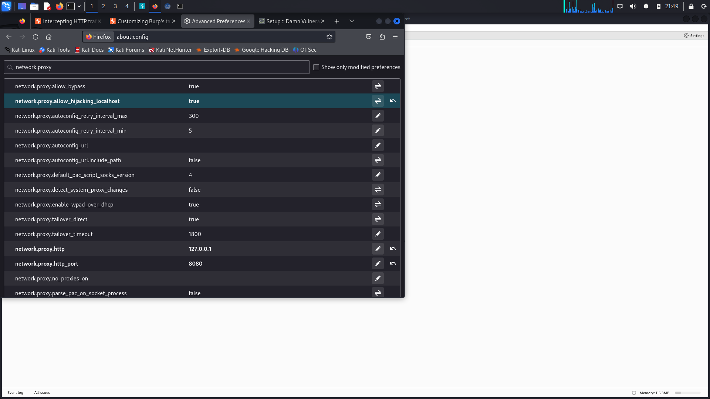
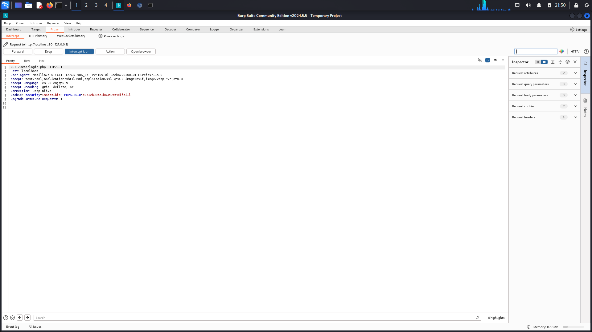
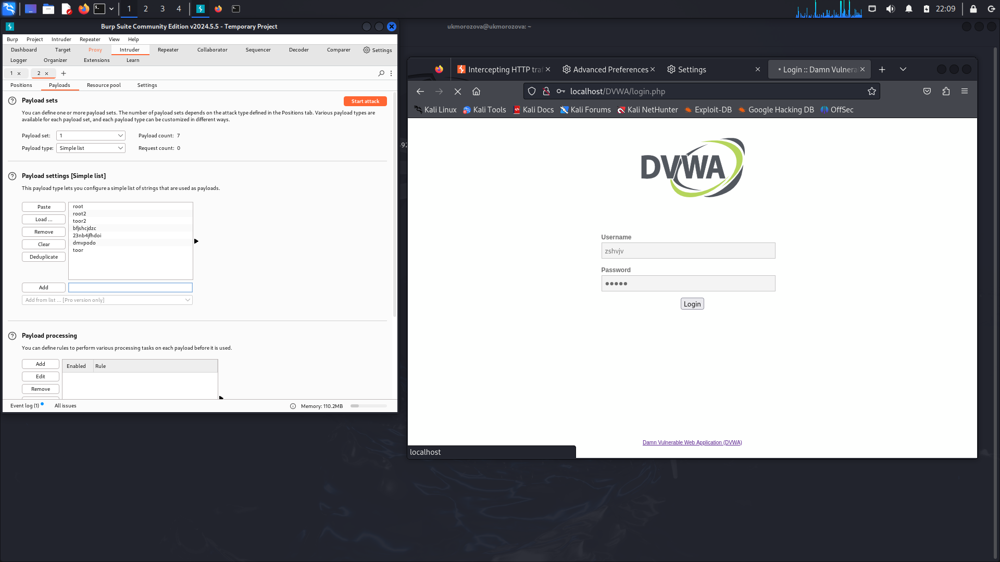
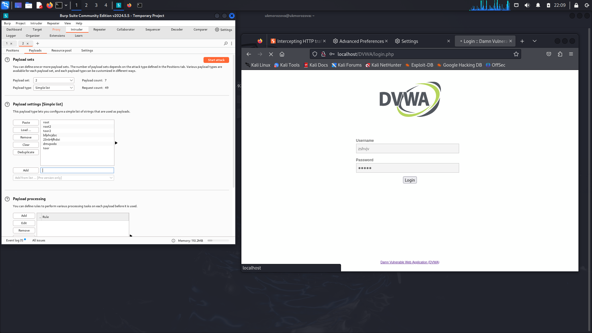
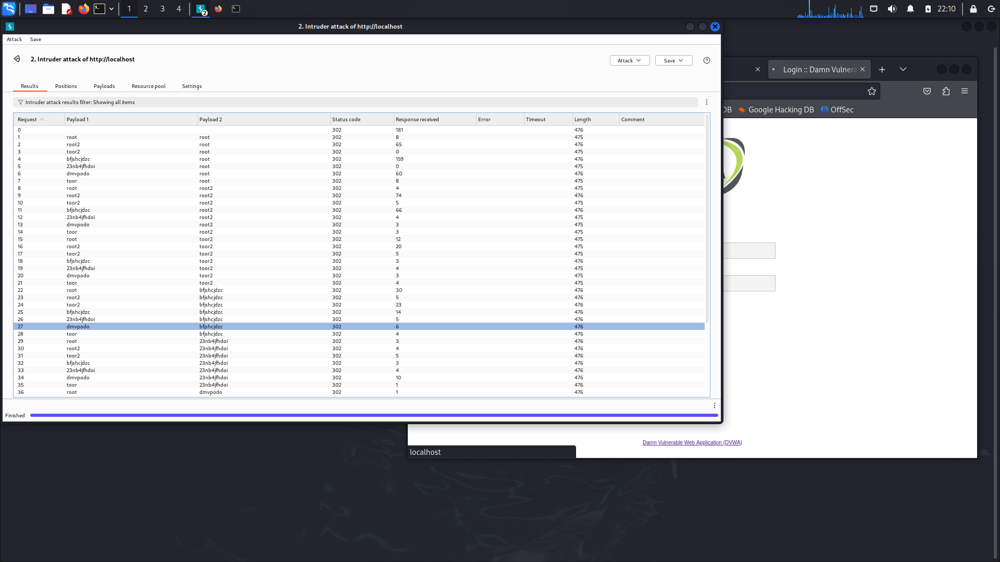
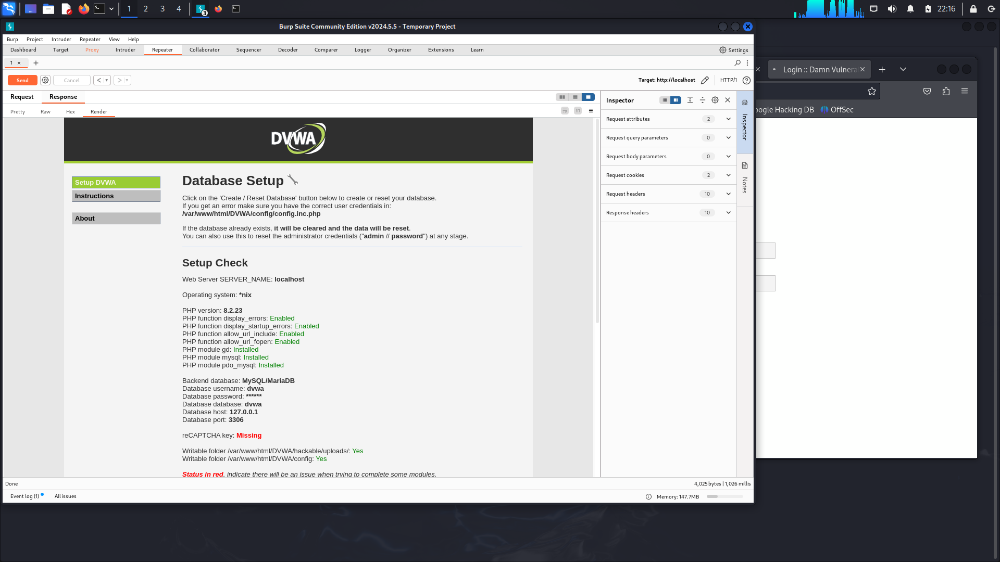

---
## Front matter
lang: ru-RU
title: Индивидуальный проект. Этап 5
author:
  - Морозова У.К.
institute:
  - Российский университет дружбы народов, Москва, Россия

## i18n babel
babel-lang: russian
babel-otherlangs: english

## Formatting pdf
toc: false
toc-title: Содержание
slide_level: 2
aspectratio: 169
section-titles: true
theme: metropolis
header-includes:
 - \metroset{progressbar=frametitle,sectionpage=progressbar,numbering=fraction}
---

# Цели и задачи

- Научиться пользоваться Burp Suite

# Выполнение лабораторной работы

## Интерфейс Burp Suite

{#fig:003 width=70%}

## Подготовка браузера 1/2

В настройках браузера Mozilla устанавливаем Proxy на наш localhost 127.0.0.1 и также устанавливаем параметр true на network.proxy.allow_hijacking_localhost.

{#fig:005 width=70%}

## Подготовка браузера 2/2

{#fig:006 width=70%}

## Перехват сигнала 

{#fig:007 width=70%}

## Подбор пароля 1/2

В Payloads заполняем случайными данные для подбора логина и пароля.

{#fig:011 width=70%}

{#fig:012 width=70%}

## Подбор пароля 2/2

{#fig:013 width=70%}

## Успешный вход в DVWA

{#fig:017 width=70%}

# Вывод

- Мы научились пользоваться Burp Suite.

