---
## Front matter
title: "Отчёт по индивидуальному проекту. Этап №5"
subtitle: "*дисциплина: Информационная безопасность*"
author: "Морозова Ульяна"

## Generic otions
lang: ru-RU
toc-title: "Содержание"

## Bibliography
bibliography: bib/cite.bib
csl: pandoc/csl/gost-r-7-0-5-2008-numeric.csl

## Pdf output format
toc: true # Table of contents
toc-depth: 2
lof: true # List of figures
lot: false # List of tables
fontsize: 12pt
linestretch: 1.5
papersize: a4
documentclass: scrreprt
## I18n polyglossia
polyglossia-lang:
  name: russian
  options:
	- spelling=modern
	- babelshorthands=true
polyglossia-otherlangs:
  name: english
## I18n babel
babel-lang: russian
babel-otherlangs: english
## Fonts
mainfont: IBM Plex Serif
romanfont: IBM Plex Serif
sansfont: IBM Plex Sans
monofont: IBM Plex Mono
mathfont: STIX Two Math
mainfontoptions: Ligatures=Common,Ligatures=TeX,Scale=0.94
romanfontoptions: Ligatures=Common,Ligatures=TeX,Scale=0.94
sansfontoptions: Ligatures=Common,Ligatures=TeX,Scale=MatchLowercase,Scale=0.94
monofontoptions: Scale=MatchLowercase,Scale=0.94,FakeStretch=0.9
mathfontoptions:
## Biblatex
biblatex: true
biblio-style: "gost-numeric"
biblatexoptions:
  - parentracker=true
  - backend=biber
  - hyperref=auto
  - language=auto
  - autolang=other*
  - citestyle=gost-numeric
## Pandoc-crossref LaTeX customization
figureTitle: "Рис."
tableTitle: "Таблица"
listingTitle: "Листинг"
lofTitle: "Список иллюстраций"
lotTitle: "Список таблиц"
lolTitle: "Листинги"
## Misc options
indent: true
header-includes:
  - \usepackage{indentfirst}
  - \usepackage{float} # keep figures where there are in the text
  - \floatplacement{figure}{H} # keep figures where there are in the text
---

# Цель работы

Использование Burp Suite.

# Выполнение лабораторной работы

1. Запустим необходимые для работы приложения такие, как Apache (рис. [-@fig:001]).

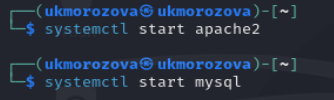{#fig:001 width=70%}

Запускаем Burp Suite через терминал (рис. [-@fig:002] - рис. [-@fig:003]).

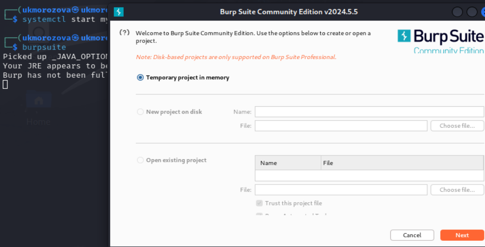{#fig:002 width=70%}

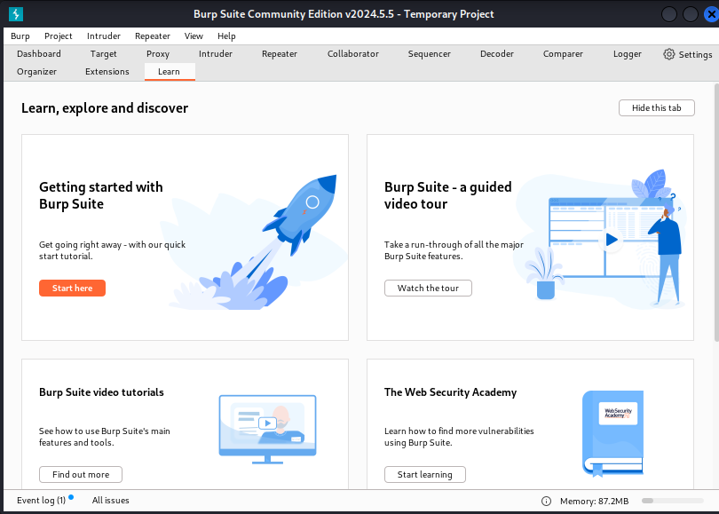{#fig:003 width=70%}

2. Во вкладке Proxy убедимся, что Intercept включен (рис. [-@fig:004]).

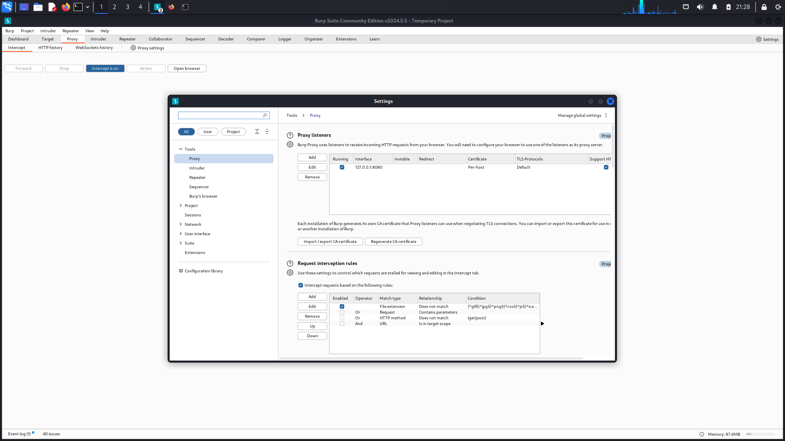{#fig:004 width=70%}

Далее в настройках браузера Mozilla устанавливаем Proxy на наш localhost 127.0.0.1 (рис. [-@fig:005]) и также устанавливаем параметр true на network.proxy.allow_hijacking_localhost (рис. [-@fig:006]).

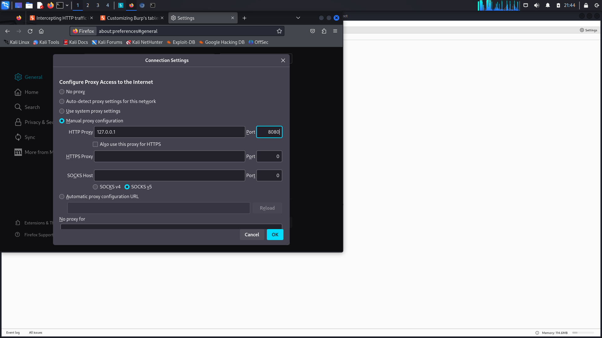{#fig:005 width=70%}

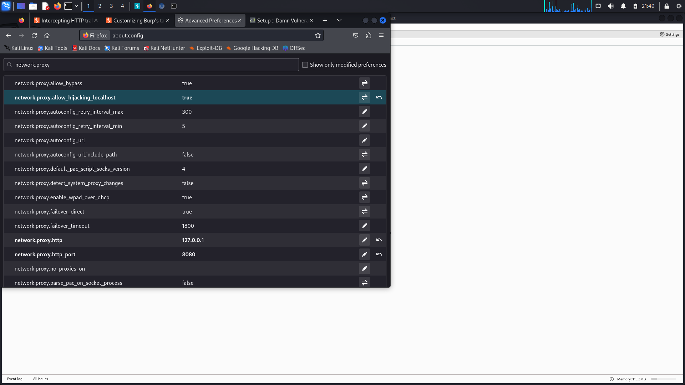{#fig:006 width=70%}

3. Теперь пытаемся зайти на страницу входа DVWA и видим, что наш сигнал был перехвачен Burp Suite (рис. [-@fig:007]).

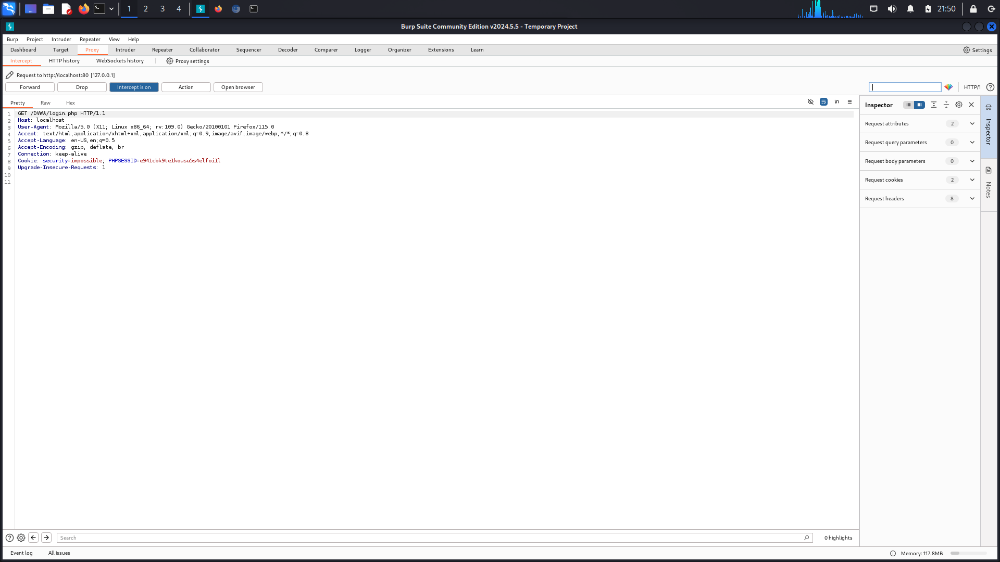{#fig:007 width=70%}

Нажимаем Forward и переходим на вкладку Target (рис. [-@fig:008]), где можно увидеть все истории запросов. Пробуем вести какой-нибудь пароль и логин на странице DVWA и наблюдаем, что запрос был отображен в Burp Suite (рис. [-@fig:009]).

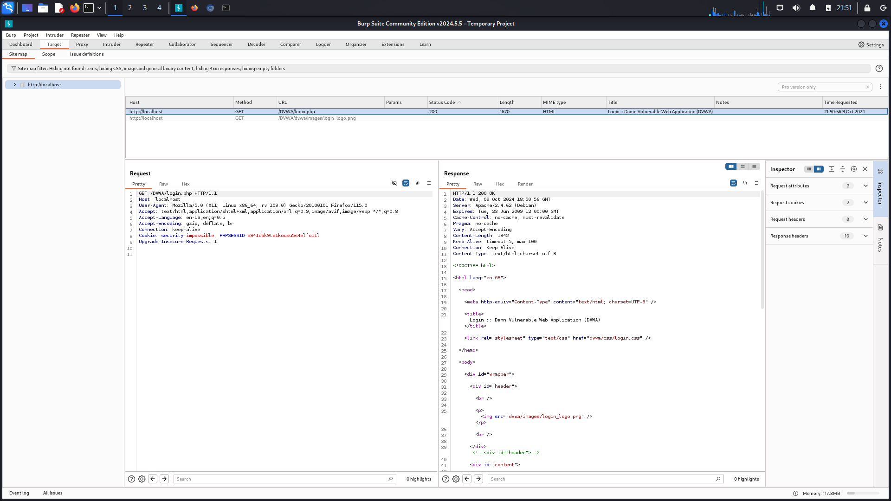{#fig:008 width=70%}

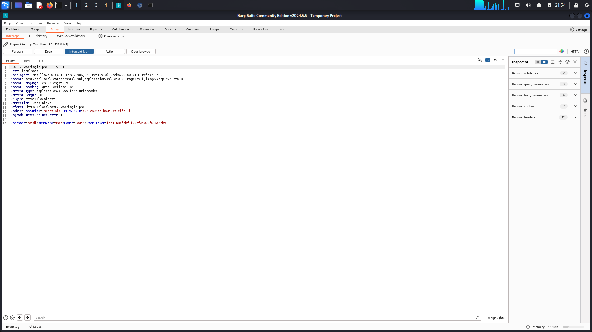{#fig:009 width=70%}

Находим этот запрос в Target и отправляем во вкладку Intruder, нажав правую кнопку мыши и найдя команду Send to Intruder. Перейдя во вкладку Intruder, изменим тип аттак на Claster Bomb и отметим специальными знаками в запросе те данные, которые хотим подобрать, то есть логин и пароль (рис. [-@fig:010]). 

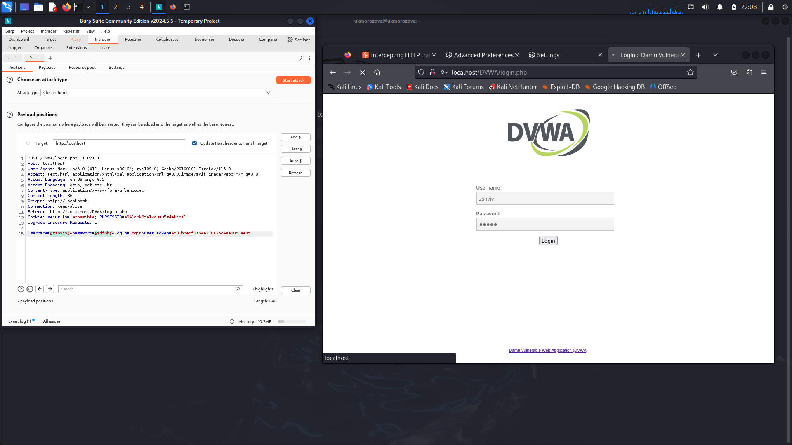{#fig:010 width=70%}

В Payloads заполняем случайными данные для подбора логина и пароля (рис. [-@fig:011] - рис. [-@fig:012])

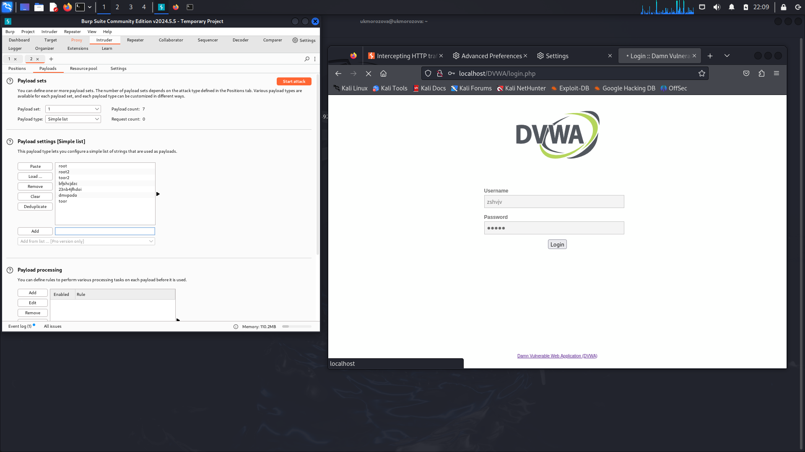{#fig:011 width=70%}

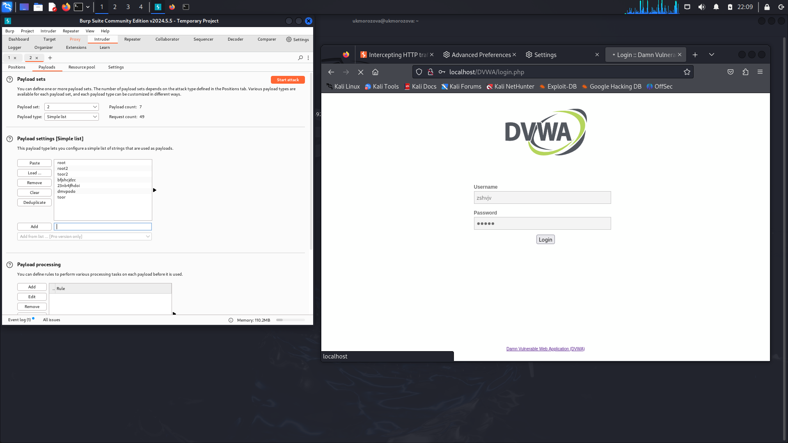{#fig:012 width=70%}

После нажатия кнопки Start Attack программа начинает перебирать всевозможные комбинации для входа (рис. [-@fig:013]). Находим единственно верную комбинацию и отправляем в Repeater (рис. [-@fig:014]) для повторной проверки и убеждаемся, что данные подходят (рис. [-@fig:015]).

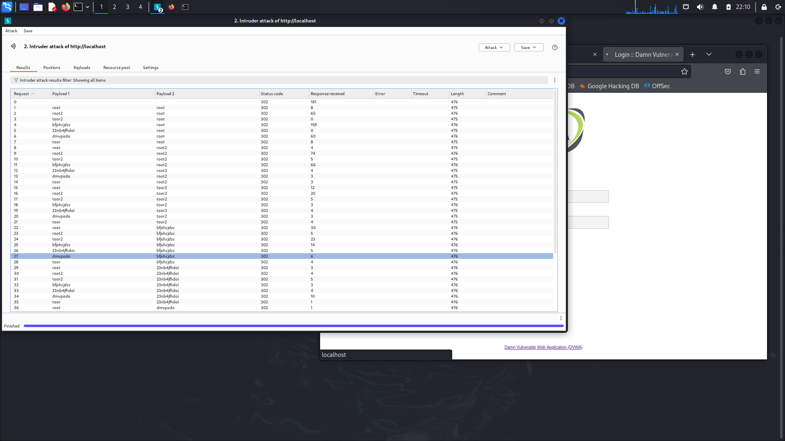{#fig:013 width=70%}

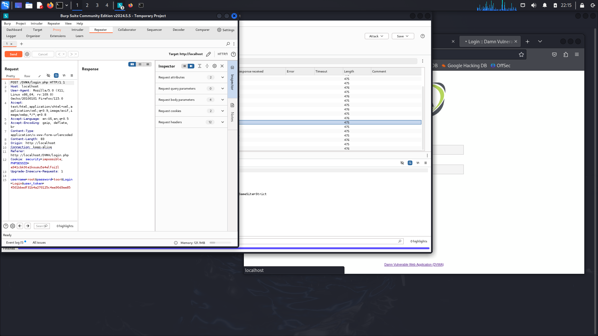{#fig:014 width=70%}

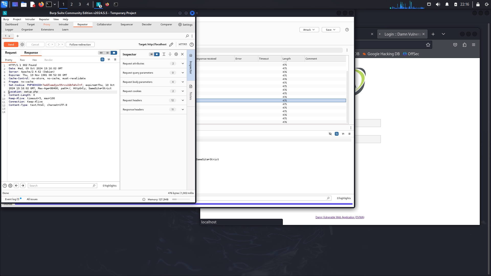{#fig:015 width=70%}

Нажимаем на Follow redirection и получаем не скомпилированный html код в окне Response (рис. [-@fig:016]).

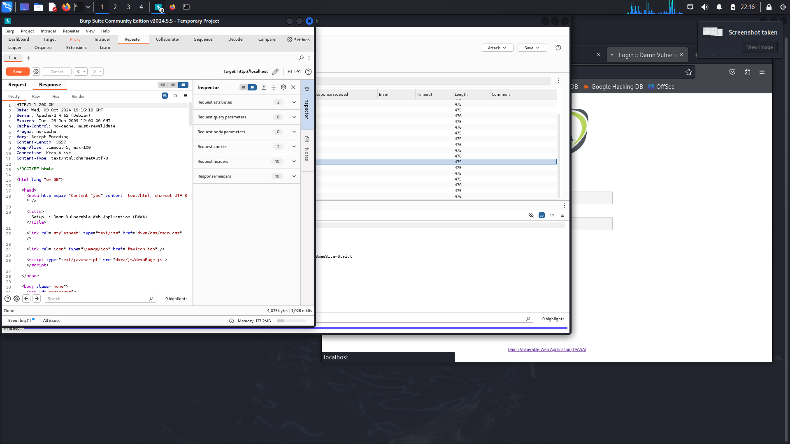{#fig:016 width=70%}

В подокне Render получаем вид страницы в браузере (рис. [-@fig:017]).

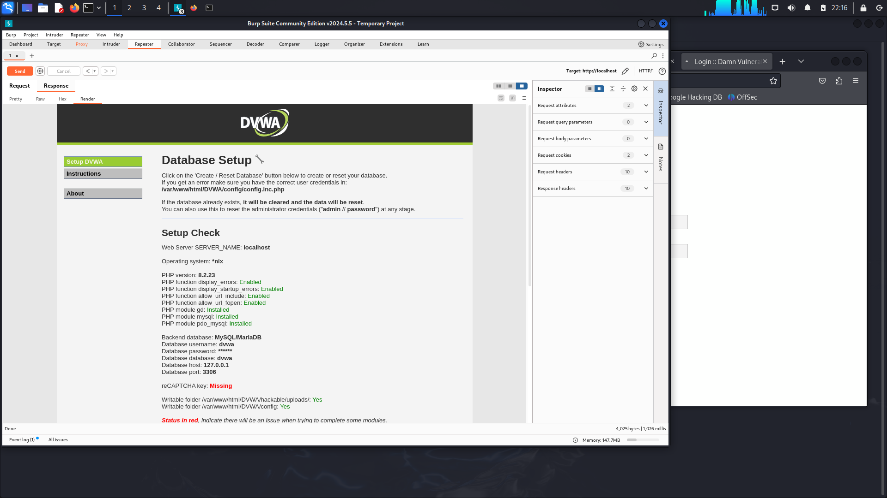{#fig:017 width=70%}

# Выводы

Мы научились пользоваться Burp Suite.

# Список литературы{.unnumbered}

::: {#refs}
:::
